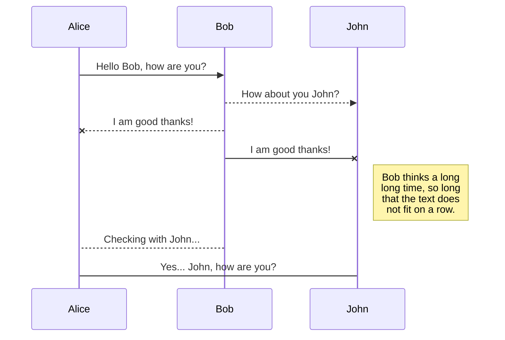
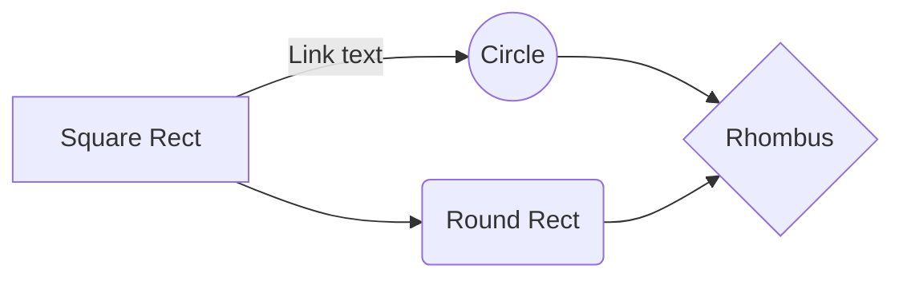

## KaTeX

You can render LaTeX mathematical expressions using [KaTeX](https://khan.github.io/KaTeX/):

The *Gamma function* satisfying $\Gamma(n) = (n-1)!\quad\forall n\in\mathbb N$ is via the Euler integral

$$ y_t = \beta_0 + \beta_1 x_t + \epsilon_t $$

> You can find more information about **LaTeX** mathematical expressions [here](http://meta.math.stackexchange.com/questions/5020/mathjax-basic-tutorial-and-quick-reference).

## UML diagrams

You can render UML diagrams using [Mermaid](https://mermaidjs.github.io/). For example, this will produce a sequence diagram:

And this will produce a flow chart:

  

| Company            | Job Role                                                                                                   | Date Applied   | Website                                                                                                                                                                                                                                                                                                                                                                                     | Submitted Email                          | Other Note                                  |
|--------------------|------------------------------------------------------------------------------------------------------------|----------------|---------------------------------------------------------------------------------------------------------------------------------------------------------------------------------------------------------------------------------------------------------------------------------------------------------------------------------------------------------------------------------------------|------------------------------------------|---------------------------------------------|
| ExxonMobil         | Software Engineering                                                                                       |                | Go to their website                                                                                                                                                                                                                                                                                                                                                                         |                                          | No sponsor                                  |
| AMD                |                                                                                                            | Awaiting       | 163 email                                                                                                                                                                                                                                                                                                                                                                                   |                                          | Invited speech email from AMD on 09/22/2023 |
| Innovative Systems |                                                                                                            | Awaiting       | 163 email                                                                                                                                                                                                                                                                                                                                                                                   |                                          |                                             |
| Astera Labs        |                                                                                                            | Awaiting       |                                                                                                                                                                                                                                                                                                                                                                                             |                                          |                                             |
| Samsung            | Specific                                                                                                   | 09/26          | Go website                                                                                                                                                                                                                                                                                                                                                                                  | Open internship in Oct, has visa sponsor |                                             |
| Apple              | Software Engineer and AI Engineer                                                                          | Sept 13        | [Apple Jobs](https://jobs.apple.com/app/en-us/profile/roles)                                                                                                                                                                                                                                                                                                                                |                                          |                                             |
| Qrypt              | Encryption                                                                                                 | 09/23          |                                                                                                                                                                                                                                                                                                                                                                                             | NYC, 25 people                           |                                             |
| DataBricks         |                                                                                                            |                | Apply online                                                                                                                                                                                                                                                                                                                                                                                | 163 and online availability              |                                             |
| Tesla              |                                                                                                            | Submitted      | 163                                                                                                                                                                                                                                                                                                                                                                                         |                                          | Has sponsor                                 |
| Ansys              |                                                                                                            |                | Apply online                                                                                                                                                                                                                                                                                                                                                                                |                                          |                                             |
| SingleStore        | DB Engineer, Infrastructure Engineer                                                                       | Applied online |                                                                                                                                                                                                                                                                                                                                                                                             |                                          |                                             |
| Amazon             | Software Engineer                                                                                          | 09/14          | [Amazon University Jobs](https://www.amazonuniversity.jobs/dashboard)                                                                                                                                                                                                                                                                                                                       | Yiyang5 email and 163 email              |                                             |
| Adobe              | Software Engineer                                                                                          | 09/14          | 163 email                                                                                                                                                                                                                                                                                                                                                                                   |                                          |                                             |
| Recorded Future    | Senior Threat Intelligence Analyst, Threat Intelligence Analyst                                            | 09/14          | 163 email for senior, Yiyang5 email for normal                                                                                                                                                                                                                                                                                                                                              | Submitted from Handshake                 |                                             |
| Standard Notes     |                                                                                                            |                | Yiyang5 email                                                                                                                                                                                                                                                                                                                                                                               | Applied using email                      |                                             |
| SpaceX             | Intern                                                                                                     | 09/19/23       | [SpaceX Careers](https://www.spacex.com/careers/jobs/?type=intern)                                                                                                                                                                                                                                                                                                                          |                                          | Rejected 09/26/23                           |
| Yahoo              | Intern                                                                                                     | 09/20          | [Yahoo Inc](https://www.yahooinc.com/careers/introduce_yourself/carnegiemelloninternsiy2023.html)                                                                                                                                                                                                                                                                                           |                                          |                                             |
| PayPal             | Intern                                                                                                     | 09/21          | [PayPal](https://paypal.eightfold.ai/careers?query=intern\&pid=274895633121\&Job%20Category=\&Country=United%20States%20of%20America\&domain=paypal.com\&sort_by=relevance\&show_multiple=false#apply)                                                                                                                                                                                      |                                          |                                             |
| CGI                | Intern                                                                                                     | 09/21          | [CGI](https://clients.njoyn.com/corp/xweb/XWeb.asp?NTKN=c\&page=MyProfile_MySkills)                                                                                                                                                                                                                                                                                                         |                                          |                                             |
| Cloud Resources    |                                                                                                            | 09/23          |                                                                                                                                                                                                                                                                                                                                                                                             |                                          |                                             |
| Meta               |                                                                                                            | 09/23          | [Meta Careers](https://www.metacareers.com/jobs/571804751608946/?rx_campaign=Linkedin1\&rx_ch=connector\&rx_group=126320\&rx_job=a1K2K000008UcoiUAC_1309dbe4\&rx_medium=post\&rx_r=none\&rx_source=Linkedin\&rx_ts=20230917T184801Z\&rx_vp=slots\&utm_campaign=Job%2Bboard\&utm_medium=jobs\&utm_source=LIpaid\&rx_viewer=95715c0555c011ee8a6ee1ae47ed345ca3f0dddd582344efa00526e240dd360b) | Has profile for Meta career              |                                             |
| EA Games           |                                                                                                            | 09/26          | Yiyang5 email                                                                                                                                                                                                                                                                                                                                                                               |                                          |                                             |
| Microsoft          | Software Engineering (Atlanta and Redmond)                                                                 | 09/28          | [Microsoft Jobs](https://jobs.careers.microsoft.com/actioncenter/submitted)                                                                                                                                                                                                                                                                                                                 | 163 email                                |                                             |
| Experian           |                                                                                                            | 09/26          | [Experian](https://jobs.smartrecruiters.com/ni/Experian/00f1dde6-f2b8-4247-89d2-d4238fb6360f-information-security-governance-policy-analyst-intern)                                                                                                                                                                                                                                         |                                          |                                             |
| Intel              | Cloud Engineer, Software Engineer                                                                          | 09/28          | [Intel Jobs](https://intel.wd1.myworkdayjobs.com/en-US/External/userHome)                                                                                                                                                                                                                                                                                                                   | Yiyang5 email                            | Full stack reject on Oct. 4, 4 jobs         |
| NVIDIA             |                                                                                                            | 09/28          | [NVIDIA Jobs](https://nvidia.wd5.myworkdayjobs.com/en-US/NVIDIAExternalCareerSite/userHome)                                                                                                                                                                                                                                                                                                 | Yiyang5 email                            | 3 jobs                                      |
| IBM                |                                                                                                            | 09/28          | [IBM Jobs](https://krb-sjobs.brassring.com/TGnewUI/Search/home/HomeWithPreLoad?PageType=JobDetails\&partnerid=26059\&siteid=5016\&jobid=695753\&codes=SN_LinkedIn#Applypage)                                                                                                                                                                                                                |                                          | 6 intern positions, 1 full-time position    |
| Experian           | Security Engineering Intern, Data Engineering/Data Analyst Intern, Web Developer Intern, Consumer Services |                |                                                                                                                                                                                                                                                                                                                                                                                             |                                          | Interview between Oct. 12 and Oct. 18       |
| TikTok             |                                                                                                            | 10/5           |                                                                                                                                                                                                                                                                                                                                                                                             |                                          |                                             |
| Google             |                                                                                                            | 10/5           |                                                                                                                                                                                                                                                                                                                                                                                             |                                          |                                             |
| Formlabs           |                                                                                                            | 10/9           | From Handshake                                                                                                                                                                                                                                                                                                                                                                              | Yiyang5 email                            |                                             |
| Nimble Robotics    |                                                                                                            | 10/9           | From Handshake                                                                                                                                                                                                                                                                                                                                                                              | Yiyang5 email                            |                                             |
| Paramount          | software engineer intern                                                                                   | 10/12          | [Paramount Webistite](https://careers.paramount.com/job/Burbank-Software-Engineering-Intern-%28Summer-2024-NYC%2C-LA-or-Remote%29-CA-91505/1082274800/)                                                                                                                                                                                                                                     | yiyang5 emai                             | suubmitted                                  |

